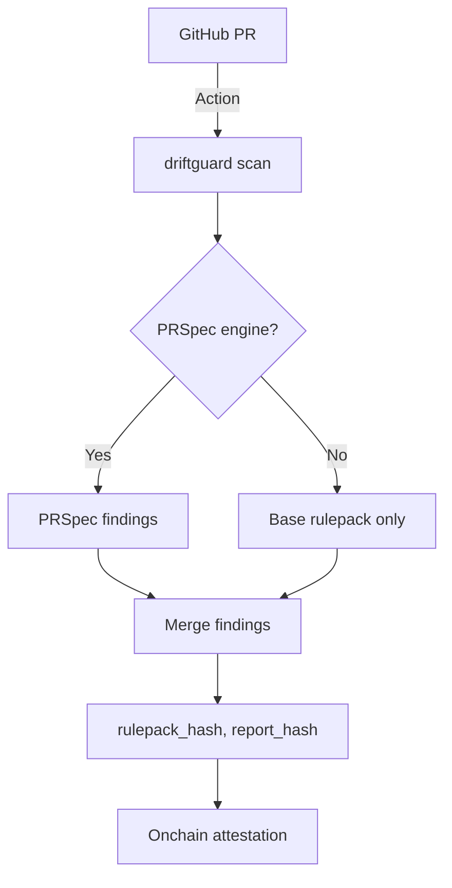

<p align="center">
	
</p>

# DriftGuard

<p align="center">
	<b>Stop smart contract risks at the PR — deterministic, onchain-attestable, and Base-native.</b>
</p>

<p align="center">
	<a href="https://github.com/Fosurero/DriftGuard/actions/workflows/driftguard.yml"></a>
	<a href="https://github.com/Fosurero/DriftGuard/blob/main/LICENSE"></a>
	
	
	
</p>

---

## 🚀 Why Base Needs DriftGuard

- **PRs are the new attack surface:** Most exploits start with a pull request. DriftGuard scans every PR for critical risks before code merges.
- **Deterministic, reproducible, and verifiable:** Every scan is cryptographically hashed (`rulepack_hash`, `report_hash`) and can be attested onchain.
- **Grant-ready for Base:** Designed for Base’s security needs, with a transparent rulepack and onchain registry.

---

## 🎯 Features & Milestones

- [x] Deterministic Base rulepack (10+ rules, IDs DG-BASE-001..010)
- [x] PRSpec engine integration (optional, auto-detect)
- [x] Onchain attestation contract (`DriftGuardRegistry`)
- [x] GitHub Action for PR scanning and artifact upload
- [x] CLI: `driftguard scan <path> --chain base --format md|json`
- [x] Grant reviewer quickstart & demo output
- [ ] PR comment bot (TODO)
- [ ] Rulepack auto-update (future)

---

## 🏆 Hook: Why Reviewers Approve DriftGuard

> "DriftGuard is the missing link for Base: it makes every PR security-auditable, reproducible, and onchain-verifiable — before code ever hits mainnet."

---

## 🛠️ Quickstart

```bash
python -m venv .venv && source .venv/bin/activate
pip install -U pip
pip install -e .
driftguard scan examples/vulnerable --chain base --format md
```

Expected output:
```md
# DriftGuard Report

- Target: examples/vulnerable
- Chain: base
- Findings: 8 (HIGH: 2, MED: 4, LOW: 2)
- rulepack_hash: sha256:480e6724dc5f292bb1a7449a83be9c46f406ac5be7b3c98fcbc5cff9371bc1a4
- report_hash: sha256:98f0cd0b86c34524d1f6c1da6e5d84b10afc02de938869d02e934a488e1a0a76

## Findings
| ID | Severity | Source | File | Line | Message |
|---|---|---|---|---:|---|
| DG-BASE-001 | HIGH | DriftGuard | examples/vulnerable/Example.sol | 8 | Detects tx.origin in authorization logic. |
| DG-BASE-002 | HIGH | DriftGuard | examples/vulnerable/Example.sol | 14 | Detects low-level .call usage that may be unchecked. |
... (see full report)
```

---

## 🧑‍💻 Running Guide

### CLI Usage

```bash
driftguard scan <path> --chain base --format md|json
# Example:
driftguard scan examples/vulnerable --chain base --format md
```

### GitHub Action

See `.github/workflows/driftguard.yml` — runs on every PR, uploads `driftguard_report.md` as an artifact.

### Onchain Attestation

1. Build and test contract artifacts with Foundry:
	 ```bash
	 cd contracts
	 forge test
	 forge build
	 ```
2. Deploy `DriftGuardRegistry` with your `RULEPACK_HASH`:
	 ```bash
	 # export PRIVATE_KEY=0x...
	 # export RPC_URL=https://mainnet.base.org
	 # export RULEPACK_HASH=0x...
	 # forge script script/Deploy.s.sol:Deploy --rpc-url "$RPC_URL" --broadcast
	 ```
3. Verify contract source on BaseScan:
	 ```bash
	 # forge verify-contract <DEPLOYED_ADDRESS> src/DriftGuardRegistry.sol:DriftGuardRegistry \
	 #   --chain-id 8453 --watch --etherscan-api-key "$BASESCAN_API_KEY"
	 ```

---

## 📦 Rulepack & Hashing

- **Rulepack:** 10+ Base-focused rules (see `src/driftguard/rules/base/rulepack.py`)
- **rulepack_hash:** Deterministic hash of sorted rulepack (keccak256/sha256)
- **report_hash:** Deterministic hash of the full scan report
- **Onchain registry:** `contracts/src/DriftGuardRegistry.sol` (see events, mapping, and versioning)

---

## 📝 Issues & Milestones

- [ ] PR comment bot for inline feedback
- [ ] Rulepack auto-update
- [ ] Multi-chain support
- [ ] More Base-specific heuristics
- [ ] Community rule contributions

---

## 📈 Architecture



---

## 📜 License

MIT — see [LICENSE](LICENSE).